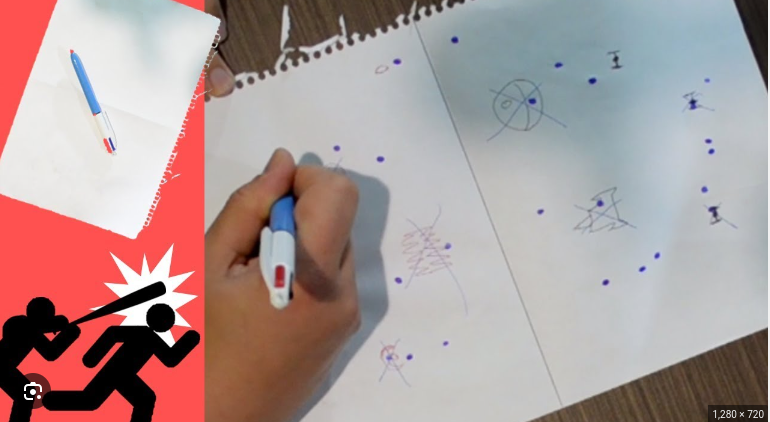

# Algoritmo do Par Mais Próximo 📍

## Temas:
- Algoritmos de Divisão e Conquista


## Alunos
| Matrícula  | Aluno                                   |
|------------|-----------------------------------------|
| 19/0048760 | Wellington Jonathan de Souza Rodrigues  |
| 20/2063346 | José Filipi Brito Souza                 |


## Sobre

Este projeto implementa um jogo simples de batalha naval inspirado na forma lúdica do jogo no papel, utilizando a biblioteca Pygame. O objetivo do jogo é utilizar a distância entre o par de pontos mais próximo, que são gerados aleatoriamente ao iniciar o jogo. A cada rodada, é calculado o valor da distância pelo algoritmo de **Par de Pontos Mais Próximos** em um plano bidimensional, utilizando a técnica de **Divisão e Conquista**. 

Dessa forma, ao atacar, o jogador escolhe a distância entre o ponto mais próximo; caso ele acerte um valor com uma margem de erro de até 10%, ele elimina um ponto e o algoritmo é recalculado. Vence o jogador que eliminar todos os pontos do adversário até que reste apenas 1 ponto.


<table>
  <tr>
    <td><a href="https://www.youtube.com/watch?v=F9EDgR6tjh8">
      
    </td>
    <td>
      <a href="https://www.youtube.com/watch?v=7zOG_E5FMZg">
        
      </a>
    </td>
  </tr>
</table>


O jogo oferece dois modos de dificuldade:

<table> 
  <tr> 
    <td>fácil
    <a href="https://www.youtube.com/watch?v=F9EDgR6tjh8">
      
    </td>
    <td> Difícil 
      <a href="https://www.youtube.com/watch?v=F9EDgR6tjh8">
      
      </a>
    </td>
  </tr>
</table>


1. **Modo Fácil**: Assim que o jogador ataca o oponente, o valor da distância entre o par de pontos mais próximo é mostrado, facilitando a estratégia para o próximo ataque.

2. **Modo Difícil**: Nesse modo, o valor da distância entre os pontos não é mostrado, aumentando o desafio.

O jogo termina assim que um dos jogadores eliminar todos os pontos do oponente.

O código está dividido em funções que geram pontos aleatórios, calculam distâncias entre eles, e utilizam tanto uma abordagem de força bruta quanto uma abordagem otimizada de divisão e conquista para identificar o par mais próximo de pontos.


## Funcionalidades
- **Geração de Pontos Aleatórios**: Criação de um conjunto de pontos com coordenadas aleatórias no plano.
- **Cálculo de Distância**: Função para calcular a distância euclidiana entre dois pontos.
- **Algoritmo de Divisão e Conquista**: Implementação otimizada para encontrar o par mais próximo em `O(n log n)`.


## Screenshots
### Tela Inicial do Jogo


### Tela de Jogo


### Tela de final do jogo


## Instalação 
**Linguagem**: Python 3.x  
**Bibliotecas**: Nenhuma biblioteca externa necessária.

### Pré-requisitos
Certifique-se de ter o Python 3.x instalado em sua máquina.

### Comandos de Instalação

1. Clone o repositório do projeto:

```bash
git clone https://github.com/seu-usuario/seu-repositorio.git
cd seu-repositorio
